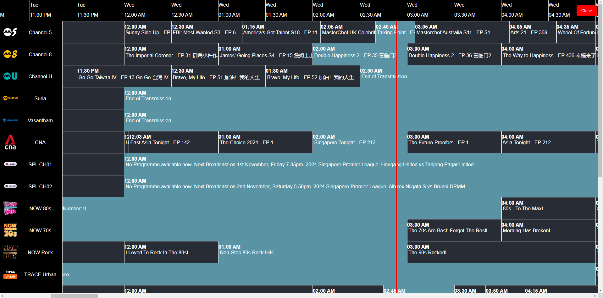
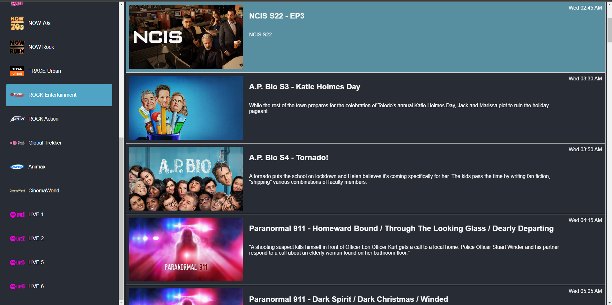

# html-epg-viewer

## Overview

HTML EPG viewer for epg.xml

https://dbghelp.github.io/epg.html?file=<link to epg.xml\>

[https://dbghelp.github.io/epg.html?file=https://raw.githubusercontent.com/dbghelp/mewatch-EPG/refs/heads/main/mewatch.xml](https://dbghelp.github.io/epg.html?file=https://raw.githubusercontent.com/dbghelp/mewatch-EPG/refs/heads/main/mewatch.xml)

## Features

- View EPG for specific channel (with thumbnail images from epg.xml)
- View EPG for all channels (Traditional EPG)
- Everything in a static html file

## Screenshots

## Usage

To be updated
